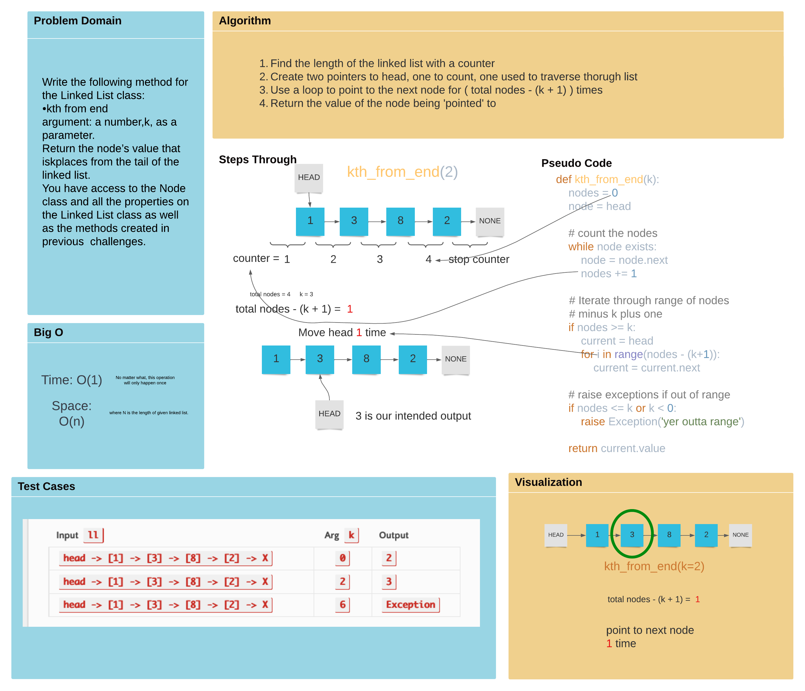

# Challenge 06 Summary
Write the following method for the Linked List class:

    kth from end
        argument: a number, k, as a parameter.
        Return the node’s value that is k places from the tail of the linked list.
        You have access to the Node class and all the properties on the Linked List class as well as the methods created in previous challenges.

## Whiteboard Process

## Approach & efficiency

## Solution
[Challenge 07 Code](/python/data_structures/linked_list.py)

## Check List
 - [X] Top-level README “Table of Contents” is updated
 - [X] README for this challenge is complete
   - [x] Summary, Description, Approach & Efficiency, Solution
   - [x] Picture of whiteboard
   - [X] Link to code
 - [X] Feature tasks for this challenge are completed
 - [X] Unit tests written and passing
   - [X] “Happy Path” - Expected outcome
   - [X] Expected failure
   - [X] Edge Case (if applicable/obvious)
