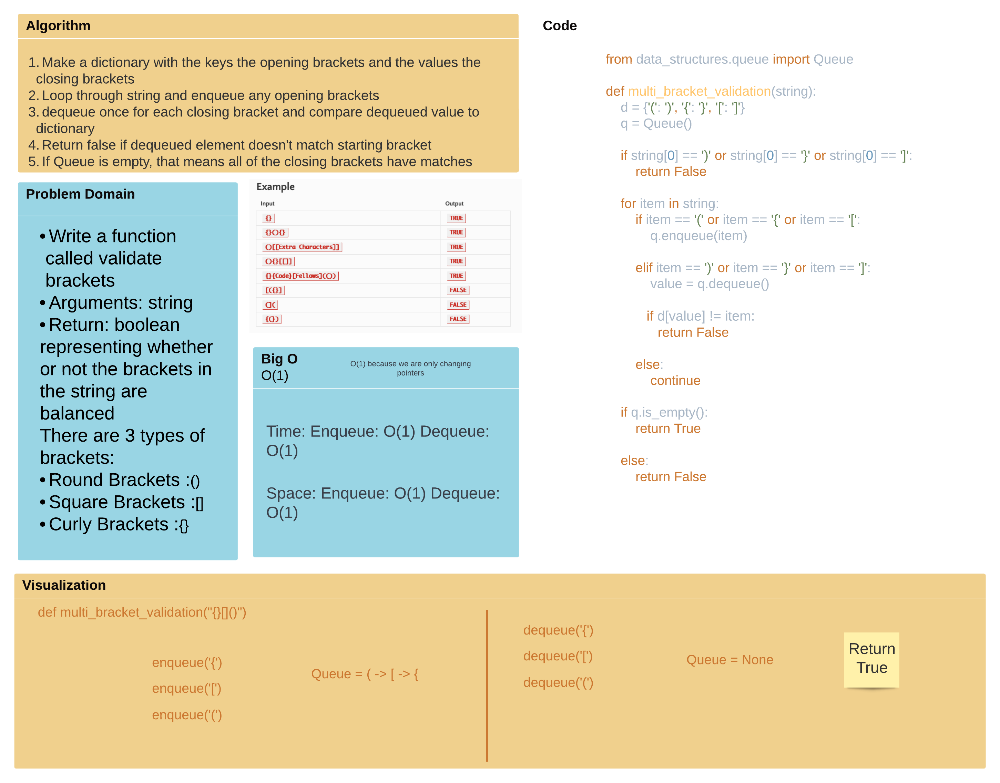

# Challenge Summary

    Write a function called validate brackets
    Arguments: string
    Return: boolean
        representing whether or not the brackets in the string are balanced

    There are 3 types of brackets:

        Round Brackets : ()
        Square Brackets : []
        Curly Brackets : {}

## Whiteboard Process

## Approach & Efficiency
These methods have an efficiency of O(1) since they are using the queue class

## [Solution](/python/code_challenges/stack_queue_brackets.py)
